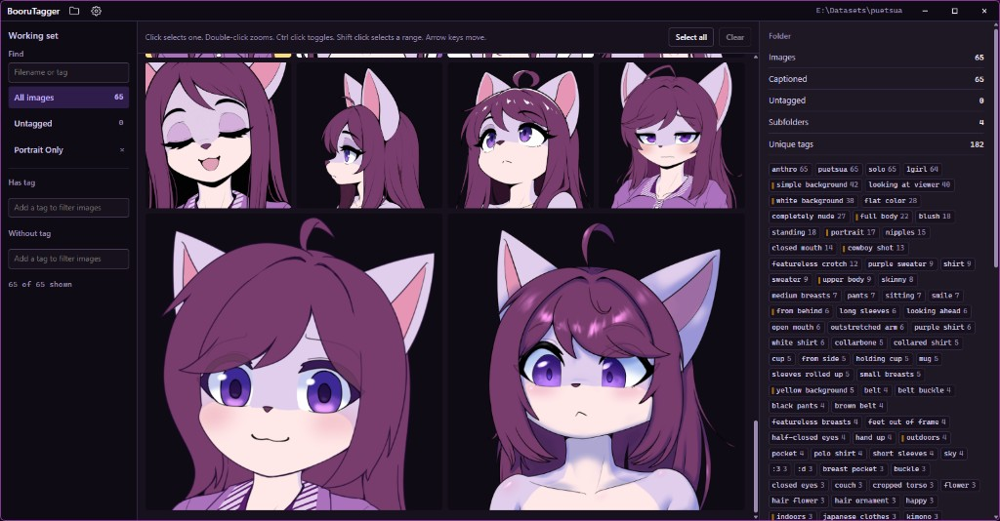

# BooruTagger


Work in progress desktop app for captioning image datasets used in LoRA training. Each image keeps a sidecar `.txt` of comma-separated tags, in the order you set.



Open a folder of images. Filter the working set, select one image or many, and edit the tags. Changes are written back to the `.txt` files. The app is still changing, so expect rough edges. Earlier design mocks are in `design/`.

## Install

The Windows installer is published from version tags. The current release is [0.2.1](https://github.com/puetsua/boorutagger/releases/tag/0.2.1).

## Develop

```sh
npm install
npm run tauri dev
```

## License

[MIT](LICENSE)
